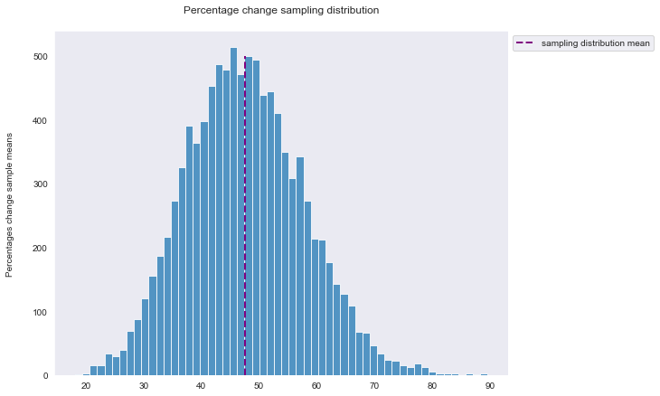
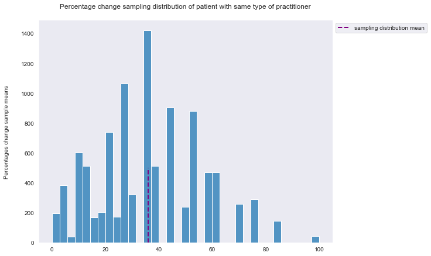
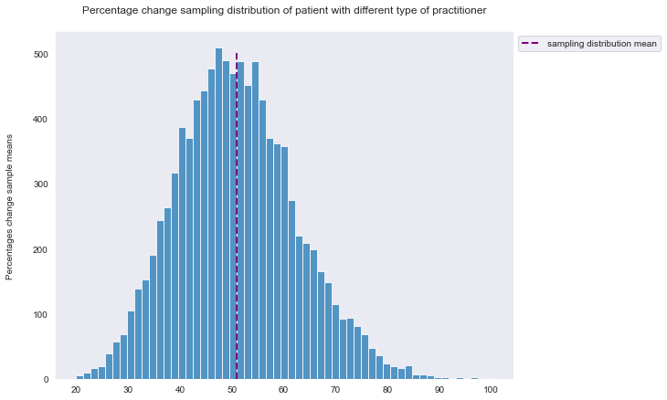

# Embr. pilot test data
An organization has collected data from individuals seeking their services related to mental health support. The data is in xlxs format with 2 sheets (check file preview and description in the repository). This project will consist of conducting a light EDA (i.e. Exploratory Analysis), and joining data from sheets as necessary to answer raised questions. 

###### Primary EDA was performed to sense the data and take action as the path unfolds grouding every decision with data nature and the domain knowledge. More details and commented code blocks are explicit in the Data_Cleaning_Rearranging.ipynb notebook

___

## Questions 

#### Question 1
what percentages of "seen" (i.e. completed) appointments were in March for minors seen by psychatrists?
Answer: An approximate 3% of the total sample (patients who attended) represents minors (i.e. The legislative texts in Lebanon are in conformity with the stipulation of article 1 of the Convention on the Rights of the Child, in which a child is defined as every human being below the age of 18) - more details in Questions_Answers.ipynb notebook in the repository.

___

#### Question 2
For patients who attended more than 1 session, what was the average percentage change in phq9 scores? is there a difference in percentages variation between patients who saw 1 type of practitioner and those who did not?

Answer: The average percentage change for the sample (patients who attented more than once) is with a 95% confidence at a 47% average between 47.34 and 47.73 - more details in Questions_Answers.ipynb notebook in the repository.

The sampling distribution of the samples' (resampled) mean is visualized below in the image.

___

Is there a difference between percentage change average of patient who saw same type of practitioner and those who did not?

The sample as a whole is below 30 entries, it is not recommended to run parameteric statistical tests when various assumptions related to those satistical tests are violated (we could have simply performed on the 2 samples a t-test for difference in means; However sample size is crippling and Heteroscedacity adding to that violation of distribution normality). Nevertheless, the conditions are best suited to perform a Bootstrapping on both sample and produce a sampling distribution. - more details in Questions_Answers.ipynb notebook in the repository.

The sampling distribution of the samples' -of patients who saw same type of practitioner- mean is visualized below in the image.

The mean of the percentage change for the patient who attended more than once with the same type of practitioner is 36.08 with a 95% confidence between 35.7 and 36.47 

___

The sampling distribution of the samples' -of patients who saw different type of practitioner- mean is visualized below in the image.

The mean of the percentage change for the patient who attended more than once with the same type of practitioner is 50.92 with a 95% confidence between 50.7 and 51.15

___

As observed, the 2 sampling distribution's mean C.I do not overlap, which is a clear indication that the 2 sample's means are in deed different and not just due to randomness in the data. In other words people who have had saw different type of practitioners on their multiple visits have a greater percentage average change in their phq9 scores than those who had saw only the same type of practitioner during their multiple visits. 
Furthermore, No conclusion can be drawn from this different since percentages change were computed in their absolute values, it is not possible to know if the phq9 percentage average change for patients who saw different practitioners means that on average the scores decreased. 

___

#### Question 3
Among those patients who attended more than one session in March, compute the proportion of males to females

P.S: with the regards to the question formulation (males to females): it is understood that a ratio computation is required, Nevertheless, both ratio and proportions will be computed - more details on computations in Questions_Answers.ipynb notebook in the repository.

There are 15 male and 5 females in march that attended more than once regardless of the practitioner type in each visit. 

The ratio of male to females in the sample is 3 to 1 (3:1). Which means that for every 3 males there is one female

The proportions of males and females in the sample:
males -> 15:20 -> 3:4, means for every 4 patients who attended more than once in March, there are 3 males 
females -> 5:20 -> 1:4, means for every 4 patient who attended more than once in March, there is 1 female

___

## Project's tools
Juptyer, Python libraries: Numpy, Pandas, Matplotlib, Seaborn, Scipy, datetime, sklearn
